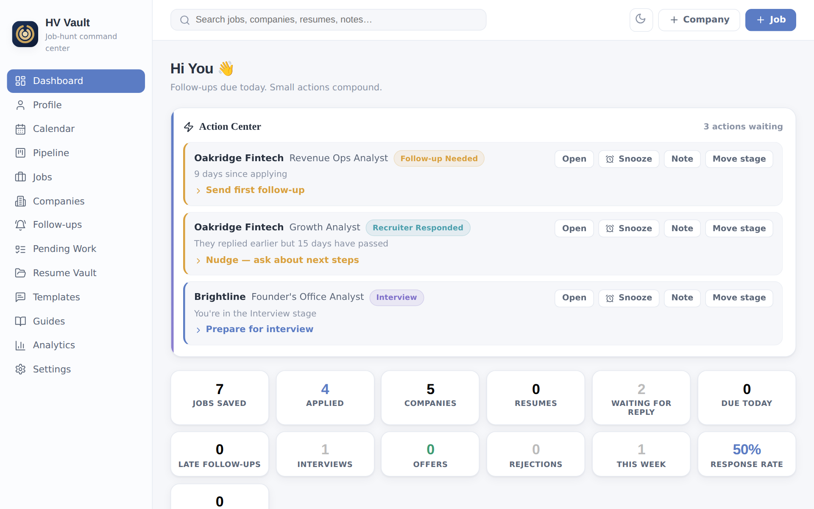
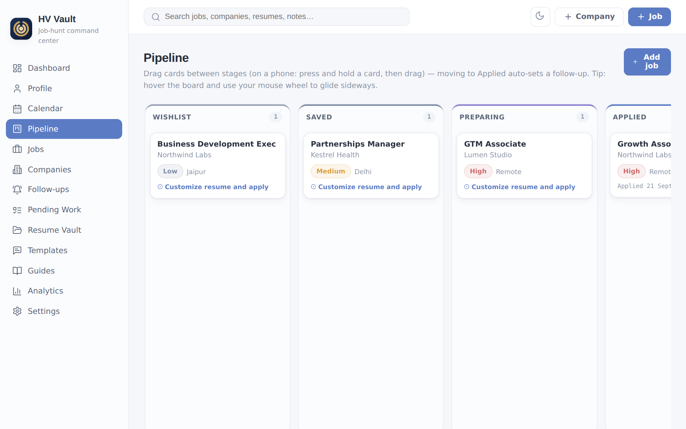
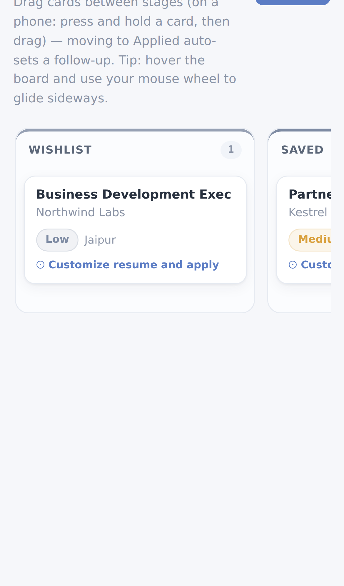
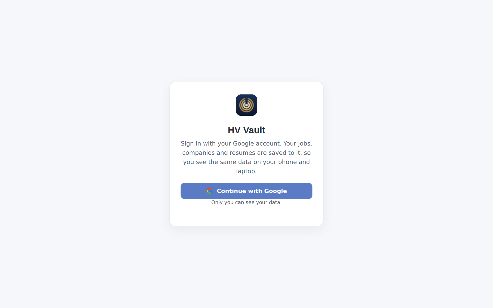

# HV Vault

A private job-hunt command center that runs in your browser. Track the jobs you save and apply to, the companies behind them, follow-ups, interviews and resumes, and see how your search is going. Sign in with Google and the same data is on your phone and your laptop.

**Live app:** https://harshvittori.github.io/hv-vault-web/



## What it does

- **Dashboard.** Jobs saved, applications, follow-ups due, interviews and response rate at a glance, plus a "next best action" for each job.
- **Pipeline.** A board with one column per stage (Wishlist to Offer). Drag cards between stages; on a phone, press and hold a card, then drag. Moving a job to Applied sets a follow-up automatically.
- **Jobs and companies.** Details, notes, tags, priority, links and a timeline for each job.
- **Follow-ups and calendar.** Every interview, follow-up and deadline in one place.
- **Resume vault.** Upload PDF or Word resumes (up to 3.5 MB each), link them to applications and see which one gets responses.
- **Analytics.** Charts for applications, responses and sources over time.
- **HV Reset link.** If you use [HV Reset](https://harshvittori.github.io/harsh-reset/) in the same browser, the sidebar links to it and each job shows a 2-minute apply-rule check.

| Pipeline | On a phone | Sign in |
|---|---|---|
|  |  |  |

Screenshots use made-up sample data.

## How your data is stored

- **Your Google account is the home of your data.** After you sign in, everything (jobs, companies, follow-ups, settings and resume files) is saved in [Cloud Firestore](https://firebase.google.com/docs/firestore) under `users/<your account id>/`, in the Firebase project `harsh-reset`.
- **Only you can read it.** Firestore security rules allow a signed-in user to read and write only their own `users/{uid}/` space and deny everything else.
- **The browser keeps a working copy.** It makes the app fast and lets it keep working through a short connection drop. Changes are saved to your account within about a second, and other signed-in devices pick them up within about 15 seconds.
- **Signing out removes the copy from that browser.** Your data stays in your account. Another Google account on the same browser starts empty and never sees yours.
- **Large files are split.** A Firestore document holds about 1 MB, so bigger resume files are stored in pieces and joined back together when you open them.
- **Backups.** Dashboard > Import / export downloads a JSON file of everything. Keep one now and then.

`firebase-config.js` holds the Firebase web config (API key, project ID, app ID). These values are public by design; the security rules are what protect the data. No service-account keys or other secrets are in this repo.

## Project layout

Flat layout, built by GitHub Actions (`.github/workflows/pages.yml`) with Vite and deployed to GitHub Pages on every push to `main`.

| File | What it is |
|---|---|
| `App.jsx` | The whole app UI (kept as one file) |
| `main.jsx` | Entry point |
| `auth-gate.jsx` | Google sign-in screen shown before the app |
| `web-bridge.js` | Browser storage (IndexedDB) and the cloud sync engine |
| `hv-cloud.js` | Firebase Auth and Firestore REST calls |
| `firebase-config.js` | Public Firebase web config |
| `index.css`, `index.html`, `vite.config.js`, `package.json` | Build setup |

To build locally:

```sh
npm install
npx vite build        # output in dist/; the workflow also copies firebase-config.js into dist/
```

## License

[MIT](LICENSE) © 2026 Harsh Goyal
